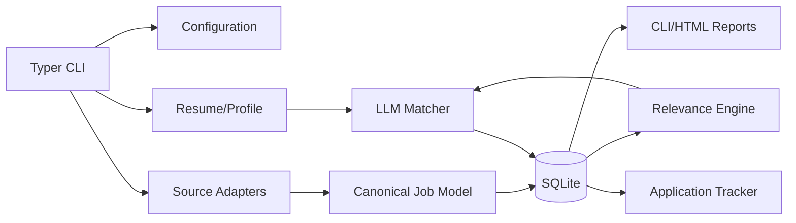

# Architecture

## Target Shape

## Boundaries

- `cli`: user-facing commands and output formatting.
- `config`: validated settings and data-directory resolution.
- `models`: canonical domain objects and schemas.
- `profile`: resume extraction and profile construction.
- `sources`: one adapter per external job source.
- `relevance`: deterministic filters, deduplication, and ranking inputs.
- `llm`: provider interface and structured matching/profile operations.
- `storage`: SQLite repositories and migrations.
- `reports`: human-readable and exportable views.

## Data Flow

Source adapters fetch listings, normalize them to the canonical job model, and persist idempotently. Relevance processing removes duplicates and applies user-configured constraints before LLM analysis. LLM output is validated, stored with provider/model/prompt metadata, and shown as decision support. User status changes are stored separately from source data and are never overwritten by a rescan.

## Reliability

The scan pipeline is incremental and resumable. Each source reports its own status. A failed description fetch or provider call is recorded as a recoverable error. Re-running a scan must not duplicate jobs, applications, or notifications.
