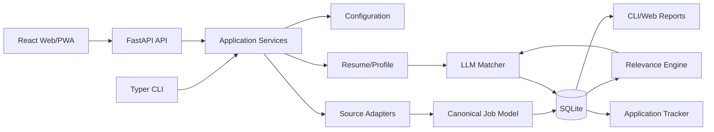

# Architecture

## Target Shape

## Boundaries

- `cli`: user-facing commands and output formatting.
- `services`: reusable application workflows shared by CLI and HTTP adapters.
- `api`: authentication, request validation, serialization, and HTTP concerns only.
- `apps/web`: React presentation, navigation, accessibility, and responsive/PWA behavior.
- `config`: validated settings and data-directory resolution.
- `models`: canonical domain objects and schemas.
- `profile`: resume extraction and profile construction.
- `sources`: one adapter per external job source.
- `relevance`: deterministic filters, deduplication, and ranking inputs.
- `llm`: provider interface and structured matching/profile operations.
- `storage`: SQLite repositories and migrations.
- `reports`: human-readable and exportable views.
- `features/profile`: web profile upload and profile-driven matching controls.

## Data Flow

Source adapters fetch listings, normalize them to the canonical job model, and persist idempotently. Relevance processing removes duplicates and applies user-configured constraints before LLM analysis. LLM output is validated, stored with provider/model/prompt metadata, and shown as decision support. User status changes are stored separately from source data and are never overwritten by a rescan.

The hosted web profile flow uploads a PDF to the API, extracts text in the API boundary, generates a structured profile through the configured provider, and stores it in the per-user `profiles` record. A user-triggered match run loads that profile and analyzes TARGET jobs through the same matching service used by the CLI. The browser never accesses resumes, providers, or source adapters directly.

## Reliability

The scan pipeline is incremental and resumable. Each source reports its own status. A failed description fetch or provider call is recorded as a recoverable error. Re-running a scan must not duplicate jobs, applications, or notifications.

## Monorepo Boundary

The frontend belongs in this repository but is independently buildable under `apps/web`. It must not import Python modules or call third-party job sources directly. `services/api` is the only browser-facing boundary. Domain logic stays in `src/career_agent` so CLI, API, and background jobs behave identically.
